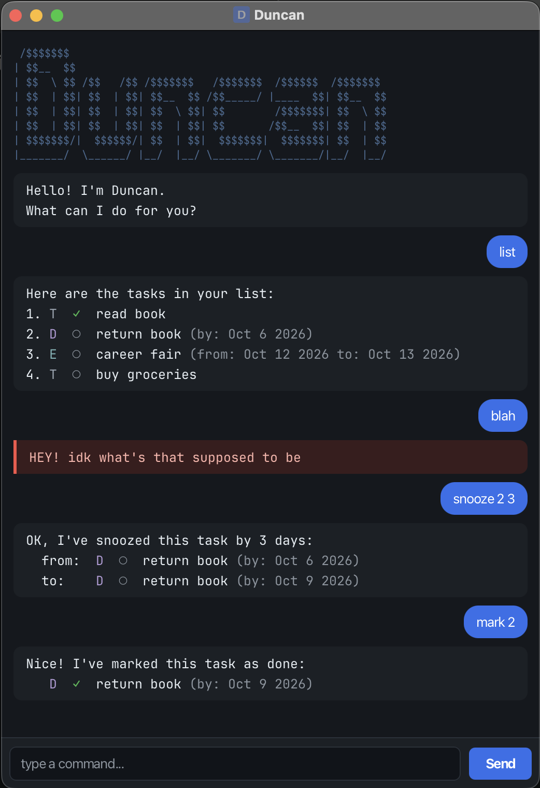

# Duncan User Guide

**Duncan** is a small chatbot that keeps track of your tasks. You type short commands, and Duncan adds, updates and finds your todos, deadlines and events for you. Your list is saved automatically, so it is still there next time.



## Quick start

1. Make sure you have **Java 25** installed. You can check by running `java -version` in a terminal.
2. Download `duncan.jar` from the [Releases](https://github.com/coffee-678/ip/releases) page of this repository.
3. Open a terminal in the folder containing `duncan.jar`, and run it with the command below. Run it from a terminal rather than double-clicking the file, or it may not start properly.

   ```
   java -jar "duncan.jar"
   ```

   Duncan's window opens.
4. Type a command into the box at the bottom and press Enter. Try `todo read book`, then `list`.

Your tasks are saved in `data/duncan.txt`, in the folder you ran the command from. Run Duncan from the same folder each time to keep seeing the same tasks.

## Features

### Notes on the command format

* Words in `UPPER_CASE` are values you supply. For example, in `todo DESCRIPTION`, you write `todo read book`.
* Command words are lowercase, e.g. `list`, not `List`.
* Dates are written as `yyyy-mm-dd`, e.g. `2026-03-25`. Duncan shows them as `Mar 25 2026`.
* Task numbers are the numbers shown by `list`, starting from 1.
* Extra spaces around a command are ignored.

### Adding a todo: `todo`

Adds a task with no date.

Format: `todo DESCRIPTION`

Example: `todo read book`

### Adding a deadline: `deadline`

Adds a task that must be done by a date.

Format: `deadline DESCRIPTION /by DATE`

Example: `deadline return book /by 2026-03-25`

### Adding an event: `event`

Adds a task that starts on one date and ends on another.

Format: `event DESCRIPTION /from DATE /to DATE`

Example: `event project fair /from 2026-03-25 /to 2026-03-26`

Things to note about adding tasks:

* The description can't be empty.
* Duncan rejects a task that is already in your list. Two tasks count as the same if they are the same type, have the same description (ignoring capital letters and extra spaces) and, for deadlines and events, the same dates. Whether a task is done doesn't matter.
* An event can start and end on the same day, but it can't end before it starts.
* The words `/by`, `/from` and `/to` mark where the dates start, so they can't appear in a deadline's or event's description. Each can be used only once per command, and `/from` must come before `/to`.

### Listing all tasks: `list`

Shows every task, with its number, type and whether it is done.

Format: `list`

Each task shows its number, then its type letter (`T` for todo, `D` for deadline, `E` for event), then `✓` if it is done or `○` if not, then its description and dates. For example:

```
1. T ✓ read book
2. D ○ return book (by: Mar 25 2026)
3. E ○ project fair (from: Mar 25 2026 to: Mar 26 2026)
```

### Finding tasks: `find`

Shows the tasks whose description contains a word or phrase. The search ignores capital letters.

Format: `find KEYWORD`

Example: `find book`

Each result keeps its number from `list`, so you can use it straight away in `mark`, `delete` and the other commands. For example, if task 1 is `project fair` and tasks 2 and 3 contain "book", the results are numbered 2 and 3:

```
2. T ○ read book
3. D ○ return book (by: Mar 25 2026)
```

### Marking a task as done: `mark`

Format: `mark TASK_NUMBER`

Example: `mark 2`

### Marking a task as not done: `unmark`

Format: `unmark TASK_NUMBER`

Example: `unmark 2`

For both `mark` and `unmark`: if the task is already in the state you asked for, Duncan tells you and changes nothing.

### Deleting a task: `delete`

Removes a task from your list.

Format: `delete TASK_NUMBER`

Example: `delete 3`

The numbers of the tasks after it go down by one.

### Changing a task's dates: `reschedule`

Gives a deadline or event new dates. Whether it is done stays the same. Todos have no dates, so they can't be rescheduled.

Formats:

* For a deadline: `reschedule TASK_NUMBER /by DATE`
* For an event: `reschedule TASK_NUMBER /from DATE /to DATE`

Examples:

* `reschedule 2 /by 2026-04-01`
* `reschedule 3 /from 2026-04-01 /to 2026-04-02`

Use the format that matches the task's type: deadlines use `/by`, events use `/from` and `/to`. An event's new dates follow the same rule as when adding: it can't end before it starts.

### Pushing a task back: `snooze`

Moves a deadline's date, or both of an event's dates, later by a number of days. Whether it is done stays the same. Todos can't be snoozed.

Format: `snooze TASK_NUMBER DAYS`

Example: `snooze 2 7` moves task 2 one week later.

`DAYS` must be a whole number of at least 1.

### Exiting: `bye`

Says goodbye and closes the window.

Format: `bye`

## Saving and your data file

Duncan saves your list to `data/duncan.txt` after every change. There is nothing to save by hand, and the `data` folder is created if it doesn't exist.

If something is wrong with the file when Duncan starts, it tells you at the top of the chat:

* **Some lines are not valid tasks** (for example, the file was edited by hand): Duncan skips those lines, tells you their line numbers, and loads the rest.
* **The whole file can't be read**: Duncan starts with an empty list.

In both cases Duncan first copies the original file to `data/duncan.txt.bak`, so you can fix it or recover from it. If that backup can't be made, Duncan turns saving off for that session so the original file is never overwritten, and warns you that new changes won't be saved.

If Duncan can't write to the file at any other time, it warns you that the change was made but not saved.

## Command summary

| Command | Format | Example |
| -------- | -------- | -------- |
| Add todo | `todo DESCRIPTION` | `todo read book` |
| Add deadline | `deadline DESCRIPTION /by DATE` | `deadline return book /by 2026-03-25` |
| Add event | `event DESCRIPTION /from DATE /to DATE` | `event project fair /from 2026-03-25 /to 2026-03-26` |
| List | `list` | `list` |
| Find | `find KEYWORD` | `find book` |
| Mark done | `mark TASK_NUMBER` | `mark 2` |
| Mark not done | `unmark TASK_NUMBER` | `unmark 2` |
| Delete | `delete TASK_NUMBER` | `delete 3` |
| Reschedule | `reschedule TASK_NUMBER /by DATE` or `reschedule TASK_NUMBER /from DATE /to DATE` | `reschedule 2 /by 2026-04-01` |
| Snooze | `snooze TASK_NUMBER DAYS` | `snooze 2 7` |
| Exit | `bye` | `bye` |

## Credits

* **JetBrains Mono** (the monospace font in the GUI): by JetBrains, from https://github.com/JetBrains/JetBrainsMono, licensed under the SIL Open Font License 1.1. The licence text is bundled at `src/main/resources/fonts/OFL.txt`.
